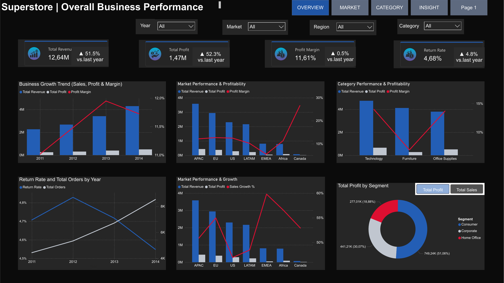
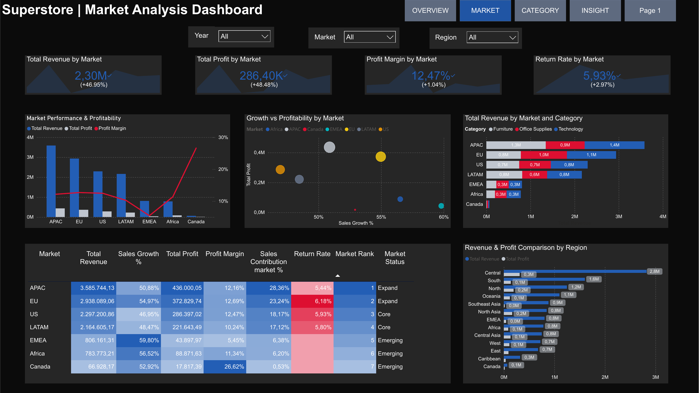
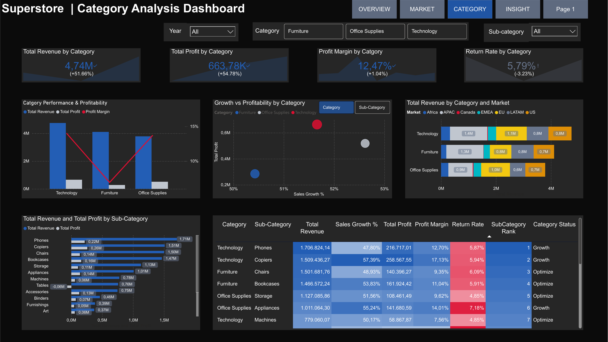
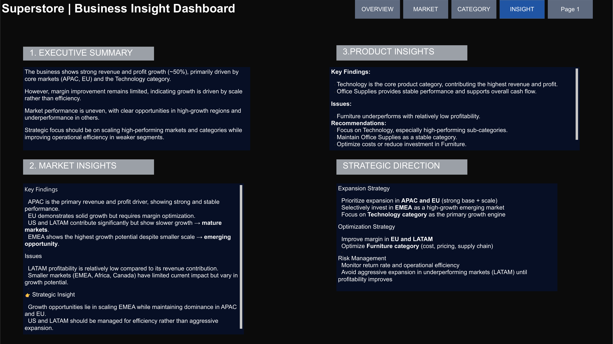

# 📊 Superstore Business Performance & Profitability Analysis \| Power BI


**Business question:** How can management identify the strongest markets
and product categories, understand profitability and growth, and
prioritize where to expand or optimize?

**Domain:** Global retail / e-commerce business\
**Tools:** Power BI • DAX • Power Query • Data Visualization\
**Author:** Nguyễn Anh Thư\
**Project Type:** Business Intelligence / Sales & Profitability Analysis

------------------------------------------------------------------------

## 📑 Table of Contents

-   [📌 Background & Overview](#-background--overview)
-   [📂 Dataset Description & Data
    Structure](#-dataset-description--data-structure)
-   [🧠 Design Thinking Process](#-design-thinking-process)
-   [⚒️ Main Process](#️-main-process)
-   [📊 Key Insights & Visualizations](#-key-insights--visualizations)
-   [🔎 Final Conclusion &
    Recommendations](#-final-conclusion--recommendations)

------------------------------------------------------------------------

## 📌 Background & Overview

### Objective

This project uses Power BI to analyze the business performance of a
global Superstore, focusing on **revenue, profit, profitability, growth,
returns, markets, regions, categories, sub-categories and customer
segments**.

The dashboard is designed to help business stakeholders answer practical
questions such as:

-   Which markets are driving revenue and profit?
-   Which markets are growing fastest?
-   Which product categories generate the strongest profit?
-   Where is profitability weak despite significant revenue?
-   Which markets or categories should be expanded, maintained, or
    optimized?
-   How are return rates changing over time?

### 👤 Who is this project for?

✔️ Sales & Business Analysts\
✔️ Commercial / Sales Managers\
✔️ Regional Managers\
✔️ Category Managers\
✔️ Business Decision-Makers

------------------------------------------------------------------------

## 📂 Dataset Description & Data Structure

### 📌 Data Source

-   Dataset: **Sample Superstore**
-   Domain: Global retail / e-commerce
-   Format: Structured sales transaction data
-   Main analytical fields: Order Date, Market, Region, Category,
    Sub-Category, Segment, Sales, Profit and Returns

### 📊 Data Structure

The analysis uses transaction-level sales data together with product,
market, customer-segment and return information.

  Field / Dimension   Business Use
  ------------------- ------------------------------------------------------
  Order Date          Time-series and year-over-year analysis
  Market              Compare APAC, EU, US, LATAM, EMEA, Africa and Canada
  Region              Drill down from market into regional performance
  Category            Compare Technology, Furniture and Office Supplies
  Sub-Category        Identify product-level growth and profitability
  Segment             Compare Consumer, Corporate and Home Office
  Sales               Revenue performance
  Profit              Business profitability
  Return Rate         Operational / customer impact

### 🥰 Data Relationships

The Power BI model connects sales, date, market, product/category and
return information to support interactive filtering and drill-down
analysis.

------------------------------------------------------------------------

## 🧠 Design Thinking Process

The dashboard was designed from a management decision-making perspective
rather than simply displaying charts.

**Empathize → Define → Ideate → Prototype & Review**

-   **Empathize:** Identify the information management needs to evaluate
    business performance.
-   **Define:** Focus the analysis on growth, profitability, market
    performance, category performance and returns.
-   **Ideate:** Select KPIs and visualizations that allow fast
    comparison across markets and categories.
-   **Prototype & Review:** Build an interactive Power BI dashboard and
    refine the layout so key findings are easy to identify.

The final dashboard is structured into four analytical views:
**Overview, Market, Category and Insight**.

------------------------------------------------------------------------

## ⚒️ Main Process

### Data Preparation

Power Query was used to prepare the dataset for analysis, including
data-type validation, field standardization and preparation of
dimensions required for reporting.

### KPI & DAX Development

Key business metrics were created to evaluate:

-   Total Revenue
-   Total Profit
-   Profit Margin
-   Sales Growth %
-   Return Rate
-   Total Orders
-   Market Contribution
-   Market Rank
-   Category / Sub-Category Rank

These measures allow the dashboard to move beyond raw sales totals and
evaluate **growth together with profitability and operational
performance**.

### Power BI Visualization

The report uses interactive slicers for Year, Market, Region, Category
and Sub-Category. Users can move from an overall performance view into
market-level and category-level analysis.

------------------------------------------------------------------------

## 📊 Key Insights & Visualizations

### 🔍 Dashboard 1 --- Overall Business Performance



The overview shows **12.64M total revenue**, **1.47M total profit**, an
**11.61% profit margin**, and a **4.68% return rate**.

Revenue and profit increased by roughly 50% versus the previous year,
indicating strong business expansion. However, the relatively limited
improvement in margin suggests that growth is being driven more by scale
than by major efficiency gains.

**Business implication:** Management should continue leveraging strong
growth while monitoring whether operating efficiency and margins improve
at the same pace.

------------------------------------------------------------------------

### 🔍 Dashboard 2 --- Market Analysis



The market view highlights substantial differences between markets.

-   **APAC** is the largest revenue contributor at approximately
    **3.59M**, with around **436K profit**.
-   **EU** contributes approximately **2.94M revenue** and **373K
    profit**, with strong growth of about **55%**.
-   **US** and **LATAM** remain important contributors but show slower
    growth, suggesting more mature markets.
-   **EMEA** records the highest sales growth at approximately
    **59.8%**, but its profit margin is only around **5.45%**, showing
    that growth has not yet translated into strong profitability.
-   **LATAM** has a relatively low profit margin of approximately
    **10.24%** compared with its revenue contribution.

**Business implication:** APAC and EU provide the strongest scale for
expansion, while EMEA represents a growth opportunity that requires
profitability monitoring. LATAM should focus on efficiency before
aggressive expansion.

------------------------------------------------------------------------

### 🔍 Dashboard 3 --- Category Analysis



Technology is the strongest category, generating approximately **4.74M
revenue** and **664K profit**.

At sub-category level:

-   **Phones** generate approximately **1.71M revenue** and **217K
    profit**.
-   **Copiers** generate approximately **1.51M revenue** and **259K
    profit**, with a strong **17.13% profit margin**.
-   **Furniture** shows weaker profitability relative to its revenue
    contribution.
-   **Office Supplies** provides a stable contribution, while some
    sub-categories show stronger growth and margins than others.

**Business implication:** Technology should remain a major growth
engine, while Furniture requires cost, pricing or supply-chain
optimization.

------------------------------------------------------------------------

### 🔍 Dashboard 4 --- Business Insight & Strategic Direction



The final insight page converts the dashboard findings into management
actions.

**Expansion Strategy**

-   Prioritize APAC and EU where there is a strong combination of scale
    and profitability.
-   Selectively invest in EMEA because of its high growth potential.
-   Continue focusing on Technology as the primary growth category.

**Optimization Strategy**

-   Improve margins in EU and LATAM.
-   Review Furniture pricing, costs and supply-chain efficiency.
-   Maintain Office Supplies as a stable contributor.

**Risk Management**

-   Monitor return rates and operational efficiency.
-   Avoid aggressive expansion in underperforming markets until
    profitability improves.

------------------------------------------------------------------------

## 🔎 Final Conclusion & Recommendations

The analysis shows that the business is experiencing strong overall
growth, but performance is not evenly distributed across markets and
categories.

📌 **Key Takeaways:**

✔️ **Scale high-performing markets:** APAC and EU should remain the main
expansion priorities because they combine strong revenue contribution
with solid profitability.

✔️ **Invest selectively in high-growth opportunities:** EMEA has the
strongest sales growth, but its low margin means expansion should be
controlled and accompanied by profitability improvement.

✔️ **Protect the Technology growth engine:** Technology generates the
highest revenue and profit, with Phones and Copiers standing out among
sub-categories.

✔️ **Optimize weaker areas:** Furniture and lower-margin markets such as
LATAM require stronger cost, pricing and operational management before
additional investment.

✔️ **Balance growth with efficiency:** Revenue and profit are growing
strongly, but management should focus on margin improvement and
return-rate monitoring to ensure growth remains sustainable.

------------------------------------------------------------------------

## 🛠️ Tools & Technologies

  Tool                      Purpose
  ------------------------- -------------------------------------------------
  **Power BI**              Interactive dashboard and business reporting
  **DAX**                   KPI, growth, profitability and ranking measures
  **Power Query**           Data preparation and transformation
  **Excel / Source Data**   Source transaction data
  **Git / GitHub**          Portfolio and version control

------------------------------------------------------------------------

## 📁 Repository Contents

``` text
ecommerce-sales-profitability-analysis/
│
├── README.md
├── ecommerce-sales-profitability-analysis.pbix
├── ecommerce-sales-profitability-analysis.pdf
└── dashboard_images/
    ├── 01_overview.png
    ├── 02_market_analysis.png
    ├── 03_category_analysis.png
    └── 04_business_insight.png
```

------------------------------------------------------------------------

## 📌 Portfolio Note

This project demonstrates how Power BI can be used not only to visualize
sales data, but also to translate business performance into **market,
category and strategic recommendations**.

The dashboard combines KPI tracking, trend analysis, profitability
analysis, market benchmarking and actionable business insights in one
reporting solution.
